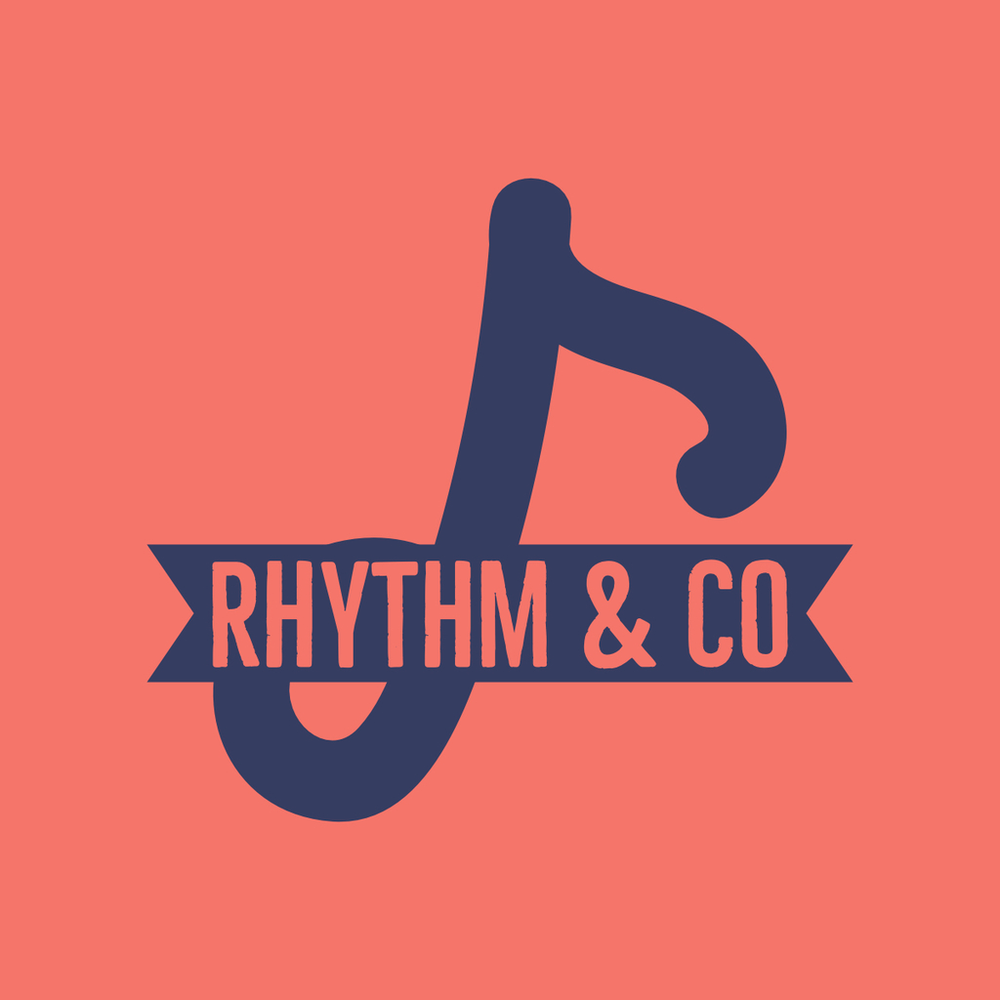
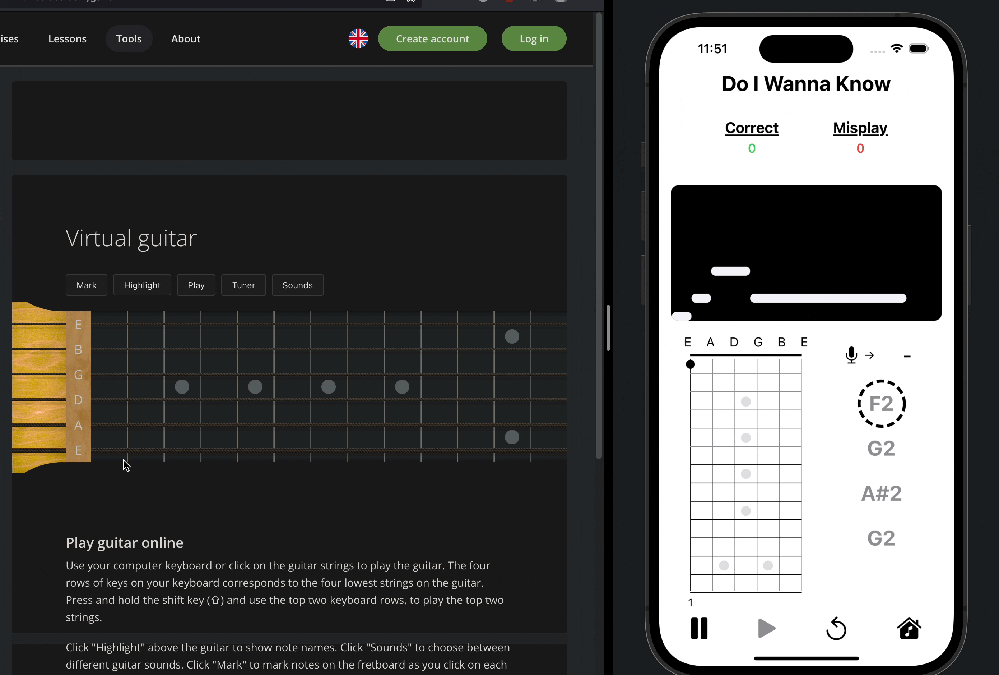
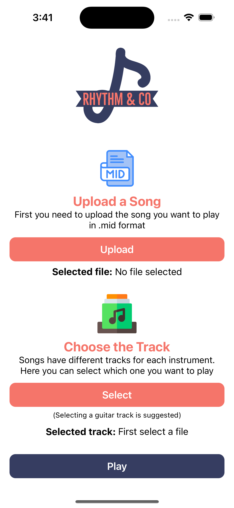
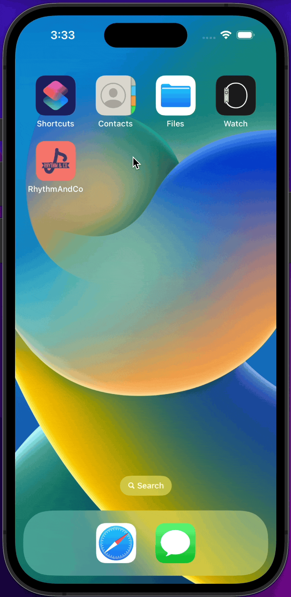
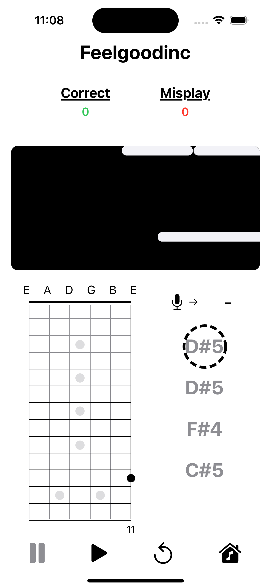
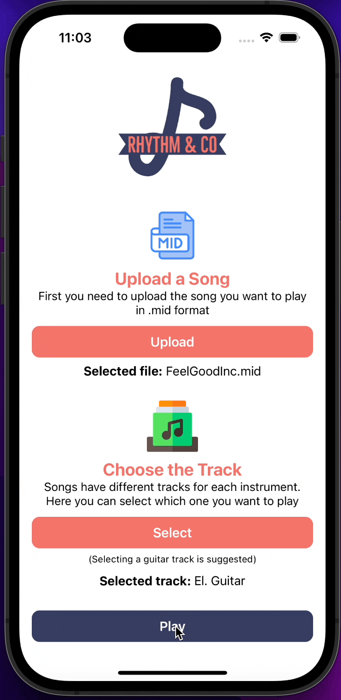

<h1 align="center">
  
   
   
  A Real-time Guitar Player Assistant
</h1>

 

 

<h1>Origin</h1>

I like playing guitar but sometimes I am having rough time learning tracks using tabletures. Tabs are quite helpful if you don't know musical notation however it lacks some important information about a note such as how long you need to play it.  

Because of that, I decided developing Rhythm & Co. It is also my first graduation project at Gebze Technical University. I developed it using Swift and SwiftUI.  

If you are interested with the details of the project, you may want to read my [graduation project report](https://github.com/tgknyhn/GTU/blob/main/Cse495/Graduation%20Project%20Report.pdf).

Also, I uploaded a Demo play to the Youtube. It is public and you can watch it from [here](https://youtu.be/t0z5uf2Mu-E). 

<h1>Features</h1>

* Import function (for MIDI files)
* Select track button (for the tracks inside a MIDI file)
* Start/Pause/Reset/Home buttons
* Fretboard view (to see where to press on guitar in order to play correct note)
* Note duration view (MIDI Sequencer)
* Musical note representation of microphone input.
* Real-time note comparison between the microphone input and the note needs to be played.
* Scrollable scroll view after finishing the song (to see correct and incorrect plays) -disabled during song-
* Real-time correct/incorrect count view.

<h1>Libraries</h1>

* [AudioKit](https://github.com/AudioKit/AudioKit)
* [Fretboard](https://github.com/itsmeichigo/Fretboard)
* [UIPilot](https://github.com/canopas/UIPilot)
* [PopupView](https://github.com/exyte/PopupView)

<h1>Icons & Logo</h1>

* [App Logo](https://www.adobe.com/express/create/logo/random)
* [MIDI Icon](https://www.flaticon.com/free-icon/mid_5105415)
* [Track Icon](https://www.flaticon.com/free-icon/music-album_1012931)

---
<h1>Screens</h1>

<h2> Home Screen </h2>

 &nbsp;&nbsp;&nbsp;&nbsp;&nbsp;&nbsp; 

<h2> Play Screen </h2>

 &nbsp;&nbsp;&nbsp;&nbsp;&nbsp;&nbsp; 

<h1>How To Use It</h1>

1. Download the MIDI version of the guitar track you want to learn from the internet.(for ex: write "Do I Wanna Know midi" to google)
2. Open the application and press upload button to import the file you downloaded from the internet.
3. Select which track you want to learn(each song has different tracks such as guitar, bass, drum, etc. please select guitar)
4. Press "Play" button and you are good to go!
5. Once you are in the play screen and feel ready, press play icon to start the song.
6. Wait until first note comes to sequencer, then try to play correct note with your guitar.(here you can look at the fretboard view to see which frets to press)
7. Play until song finishes and once you finish the song you can close the pop-up view by clicking anywhere on the screen. After that you can use scroll view to see which notes you have played incorrectly.
8. That's it! If you want to try again, press reset icon or select a new song or track by pressing home icon.

<h1>In Progress</h1>
This application is not able to recognize chords. This means if you want to learn a guitar track which contains chords in it, you can not use it effectively. I am still working on it and would be happy to hear your advices. Thanks.
